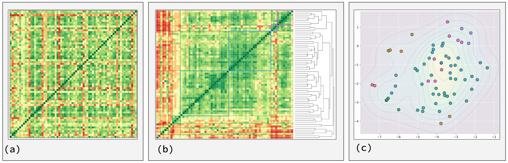

# What Lives: Definition Clustering Analysis

[](https://github.com/AttuneIntelligence/what-lives/actions)
[](https://www.python.org/downloads/)
[](https://opensource.org/licenses/MIT)
[](https://arxiv.org/)
[](https://help.zenodo.org/docs/deposit/describe-records/reserve-doi/)

A computational meta-analysis that leverages large language models (LLMs) to analyze and cluster expert definitions of life, revealing the underlying semantic landscape of how experts conceptualize "life" across different disciplines.

<p align="center">
  
</p>:

## Project Overview

The "What Lives?" project explores the diversity of expert definitions of life through:

1. **Quantitative Analysis**: Uses LLMs to generate pairwise correlation scores between definitions
2. **Semantic Clustering**: Applies hierarchical clustering to identify groups of conceptually related definitions
3. **Dimensional Reduction**: Projects high-dimensional correlation data into interpretable 2D space
4. **Thematic Analysis**: Extracts key concepts and generates consensus definitions for each cluster

This computational approach transforms the age-old philosophical question "what is life?" into a structured exploration of semantic patterns within expert discourse, revealing how different disciplinary perspectives relate to each other in a continuous conceptual landscape.

## Contents

- [Project Structure](#project-structure)
- [Installation](#installation)
  - [Using Docker (Recommended)](#using-docker-recommended)
  - [Manual Installation](#manual-installation)
- [Configuration](#configuration)
  - [API Keys](#api-keys)
  - [Environment Variables](#environment-variables)
- [Running the Analysis](#running-the-analysis)
  - [Quick Start](#quick-start)
  - [Step by Step Analysis](#step-by-step-analysis)
- [Key Components](#key-components)
- [Results and Outputs](#results-and-outputs)
- [Extending the Analysis](#extending-the-analysis)
- [Troubleshooting](#troubleshooting)
- [Citation](#citation)
- [License](#license)

## Project Structure

```
what-lives/
├── bin/                     # Shell scripts for environment setup
│   ├── jupyter.sh           # Script to launch Jupyter Lab
│   └── run.sh               # Script to build and run Docker container
├── data/                    # Input data and results
│   ├── results/             # Generated results by model
│   │   ├── Anthropic Claude 3.7 Sonnet/
│   │   ├── GPT-4o/
│   │   ├── Llama 3.3 70B Instruct/
│   │   └── Multi-Model-Average/
│   └── what_lives_definitions.xlsx  # Source definitions
├── dev.ipynb                # Main development/analysis notebook
├── Dockerfile               # Docker configuration
├── final-figures/           # Publication-ready figures
│   ├── FIGURE1_data_transformation_process.png
│   ├── FIGURE2_property_distribution.png
│   ├── FIGURE3_clustered_correlations_multi_model.png
│   └── FIGURE4_tsne_multi_model.png
├── prompts/                 # LLM system prompts
│   ├── cluster_consensus.txt
│   ├── cluster_ideas.txt
│   ├── cluster_title.txt
│   ├── default_prompt.txt
│   ├── definition_correlation.txt
│   └── discipline_vector.txt
├── requirements.txt         # Python dependencies
├── src/                     # Source code
│   ├── __init__.py
│   ├── create_figure_2.py   # Figure generation script
│   ├── inference.py         # LLM API interface
│   ├── model_config.yml     # LLM configuration
│   ├── multimodel_analysis.py  # Multi-model integration
│   ├── stats_cross_cluster.py  # Cross-cluster statistics
│   └── what_lives.py        # Main analysis class
└── supplemental/            # Supplemental figures and analyses
```

## Installation

### Using Docker (Recommended)

The easiest way to get started is using Docker, which ensures all dependencies are properly installed in an isolated environment.

1. **Install Docker Desktop**:

   - [Docker Desktop](https://www.docker.com/products/docker-desktop/) for Windows/Mac
   - [Docker Engine](https://docs.docker.com/engine/install/) for Linux

2. **Clone the repository**:

   ```bash
   git clone https://github.com/AttuneIntelligence/what-lives.git
   cd what-lives
   ```

3. **Create an `.env` file in the project root for your API keys**:

   ```
   ANTHROPIC_API_KEY=your_anthropic_key_here
   OPENAI_API_KEY=your_openai_key_here
   AWS_ACCESS_KEY_ID=your_aws_access_key
   AWS_SECRET_ACCESS_KEY=your_aws_secret_key
   ```

4. **Build and launch the Docker container**:

   ```bash
   ./bin/run.sh
   ```

5. **Start Jupyter Lab** from within the container:

   ```bash
   ./bin/jupyter.sh
   ```

6. Access Jupyter Lab in your browser at http://localhost:8888/

### Manual Installation

If you prefer not to use Docker, you can install the dependencies directly:

1. **Prerequisites**:

   - Python 3.12+
   - pip package manager

2. **Clone the repository**:

   ```bash
   git clone https://github.com/AttuneIntelligence/what-lives.git
   cd what-lives
   ```

3. **Create and activate a virtual environment** (optional but recommended):

   ```bash
   python -m venv venv
   # On Windows
   venv\Scripts\activate
   # On macOS/Linux
   source venv/bin/activate
   ```

4. **Install dependencies**:

   ```bash
   pip install -r requirements.txt
   ```

5. **Set up environment variables** for your API keys (see Configuration section)

## Configuration

### API Keys

This project requires API keys for the following services:

1. **Anthropic Claude** - For semantic analysis of definitions ([Get API Key](https://console.anthropic.com/))
2. **OpenAI** - For text embeddings and alternative LLM analysis ([Get API Key](https://platform.openai.com/account/api-keys))
3. **AWS** - For accessing AWS Bedrock services ([AWS Credentials Guide](https://docs.aws.amazon.com/sdk-for-javascript/v3/developer-guide/setting-credentials-node.html))

### Environment Variables

There are two ways to set up the required environment variables:

1. **Create a `.env` file** in the project root:

   ```
   ANTHROPIC_API_KEY=your_anthropic_key_here    # required for Claude
   OPENAI_API_KEY=your_openai_key_here          # required for GPT
   AWS_ACCESS_KEY_ID=your_aws_access_key        # required for Llama
   AWS_SECRET_ACCESS_KEY=your_aws_secret_key    # required for Llama
   ```

2. **Set environment variables directly**:

   **On Windows (Command Prompt)**:

   ```cmd
   set ANTHROPIC_API_KEY=your_anthropic_key_here
   set OPENAI_API_KEY=your_openai_key_here
   set AWS_ACCESS_KEY_ID=your_aws_access_key
   set AWS_SECRET_ACCESS_KEY=your_aws_secret_key
   ```

   **On Windows (PowerShell)**:

   ```powershell
   $env:ANTHROPIC_API_KEY="your_anthropic_key_here"
   $env:OPENAI_API_KEY="your_openai_key_here"
   $env:AWS_ACCESS_KEY_ID="your_aws_access_key"
   $env:AWS_SECRET_ACCESS_KEY="your_aws_secret_key"
   ```

   **On macOS/Linux**:

   ```bash
   export ANTHROPIC_API_KEY=your_anthropic_key_here
   export OPENAI_API_KEY=your_openai_key_here
   export AWS_ACCESS_KEY_ID=your_aws_access_key
   export AWS_SECRET_ACCESS_KEY=your_aws_secret_key
   ```

When using Docker, the `.env` file method is recommended as the environment variables will be automatically loaded into the container.

It is possible to provide only relevant API tokens for the chosen model analysis. For example, if you'd like to test the computational pipeline with just GPT-4o then you can provide only the `OPENAI_API_KEY` and ignore the rest.

## Running the Analysis

### Quick Start

The easiest way to run the analysis is using the included Jupyter notebook:

1. Start Jupyter Lab (via Docker or manually)
2. Open `dev.ipynb` in Jupyter Lab
3. Run all cells in the notebook

This will:

- Initialize the LLM clients
- Load the definitions
- Generate correlation matrices
- Perform clustering and dimensionality reduction
- Create visualizations

### Step by Step Analysis

For more control, you can run the analysis steps individually:

1. **Initialize the environment**:

```python
import json, re, os
import pandas as pd
import numpy as np
import asyncio
from inference import Inference
from what_lives import WhatLives

# Initialize inference engine
inference = Inference()

# Create WhatLives analysis object
whatlives = WhatLives(
    inference=inference,
    model="Anthropic Claude 3.7 Sonnet",
    n_max=None,  # Set to a number for subset analysis
    semaphore_limit=1,  # Controls concurrency
    n_replicates=3  # Number of replicates per correlation
)
```

2. **Generate correlation matrix**:

```python
# Check existing progress first
whatlives.print_correlation_status()

# Generate (or continue) correlation matrix
whatlives.create_correlation_matrix(
    checkpoint_freq=100,  # Save checkpoint every N pairs
    resume_from_checkpoint=True  # Resume from previous run
)
```

3. **Run clustering analysis**:

```python
# Load correlation matrix
corr_path = os.path.join(whatlives.output_dir, f"m_correlation_{whatlives.model}.npy")
correlation_matrix = np.load(corr_path)

# Generate clustered correlation heatmap with dendrogram
fig, ax_heatmap, ax_dendrogram, cluster_assignments, reordered_idx, color_map = whatlives.plot_clustered_correlation_heatmap(
    correlation_matrix,
    whatlives.definitions,
    filename='clustered_correlations.png'
)
```

4. **Perform semantic analysis of clusters**:

```python
# Analyze cluster statistics
stats = whatlives.analyze_clusters(cluster_assignments, whatlives.definitions)

# Generate semantic analysis and consensus definitions
analysis = asyncio.run(whatlives.get_cluster_analysis(
    cluster_assignments,
    whatlives.definitions
))

# Print and save results
whatlives.print_cluster_analysis(analysis, markdown_filename="cluster_semantic_analysis.md")
```

5. **Generate visualizations**:

```python
# Generate embedding projections
projections = whatlives.project_and_visualize_embeddings(
    embedding_type="bedrock",
    cluster_assignments=cluster_assignments,
    color_map=color_map,
    force_recompute=True
)

# Generate correlation-based projections
corr_projections = whatlives.correlation_based_projections_with_testing(
    correlation_matrix=correlation_matrix,
    cluster_assignments=cluster_assignments,
    color_map=color_map,
    force_recompute=True
)
```

6. **Multi-model analysis** (optional):

```python
from multi_model_analyzer import multi_model_analysis

# Initialize multiple models and average results
wl_multi, avg_matrix, cluster_assignments, color_map = multi_model_analysis(whatlives)
```

## Key Components

### `inference.py`

Handles all interactions with LLM APIs (OpenAI, Anthropic, and AWS Bedrock). It provides:

- Asynchronous API calls with retry logic
- Token usage tracking and cost calculation
- Embedding generation
- Universal interface for multiple LLM providers

### `what_lives.py`

The core analysis class that implements:

- Definition loading and preprocessing
- Correlation matrix generation and clustering
- Visualization of clusters and correlations
- Semantic analysis of clusters
- Embedding projection and dimensionality reduction

### `multimodel_analysis.py`

Combines results from multiple LLMs to create a more robust analysis:

- Loads individual model correlation matrices
- Averages matrices to create integrated results
- Compares clustering across models
- Generates comparative visualizations

### `stats_cross_cluster.py`

Provides statistical analysis of clusters:

- Calculates intra-cluster and inter-cluster correlations
- Assesses clustering stability across models
- Identifies definitions with high/low grouping consistency
- Generates statistical visualizations

## Results and Outputs

The analysis generates various outputs in the `data/results/` directory, organized by model:

### Correlation Matrices

- `m_correlation_*.npy` - NumPy array of pairwise correlation scores
- `correlation_checkpoint_*.npz` - Checkpoint files for long-running analyses
- `correlation_progress_*.json` - Progress tracking for correlation calculations

### Visualizations

- `clustered_correlations.png` - Heatmap with hierarchical clustering dendrogram
- `*_2d_*_with_names.png` - 2D projections with definition names
- `*_3d_*_with_names.png` - 3D projections with definition names
- `*_projections_panel_*.png` - Panel of different projection methods

### Semantic Analysis

- `cluster_semantic_analysis.md` - Detailed analysis of each cluster
- `model_agreement_statistics.txt` - Statistics on model consistency
- `model_cluster_consistency.png` - Visualization of cross-model agreement

### Final Results

The `final-figures/` directory contains publication-ready figures used in the manuscript:

- `FIGURE1_data_transformation_process.png` - Workflow diagram
- `FIGURE2_property_distribution.png` - Distribution of definition properties
- `FIGURE3_clustered_correlations_multi_model.png` - Clustered correlation matrix
- `FIGURE4_tsne_multi_model.png` - 2D t-SNE projection of definitions

## Extending the Analysis

### Adding New Definitions

To add new definitions to the analysis:

1. Update the `what_lives_definitions.xlsx` file with new entries
2. Re-run the analysis pipeline

### Using Different LLMs

The system supports multiple LLMs and can be easily extended:

1. Add API credentials for the new provider
2. Update `src/model_config.yml` with the new model details
3. Modify `inference.py` if needed to support the new API format
4. Initialize `WhatLives` with your chosen model:
   ```python
   whatlives = WhatLives(inference=inference, model="Your New Model")
   ```

### Customizing Prompts

All LLM prompts are stored in the `prompts/` directory as text files:

- `definition_correlation.txt` - Prompt for generating correlation scores
- `cluster_ideas.txt` - Prompt for thematic analysis of clusters
- `cluster_consensus.txt` - Prompt for generating consensus definitions
- `cluster_title.txt` - Prompt for naming clusters

You can modify these prompts to change how the LLMs analyze and interpret the definitions.

## Troubleshooting

### API Rate Limits

If you encounter errors related to API rate limits:

1. Reduce the `semaphore_limit` when initializing `WhatLives` to lower concurrency
2. Increase waiting time between retries in `inference.py`
3. Use checkpointing to split analysis across multiple sessions

### Memory Issues

For large analyses:

1. Reduce batch sizes in correlation calculation
2. Use the `n_max` parameter to work with a subset of definitions
3. Run the analysis on a machine with more RAM

### Missing Visualizations

If visualizations aren't being generated:

1. Check that Matplotlib is properly installed
2. Ensure you have the required fonts (DejaVu Sans, Arial)
3. Try running in non-interactive mode with explicit `plt.savefig()` calls

## Citation

If you use this code or methodology in your research, please cite:

```
Bender, R., Kofman, K., Agüera y Arcas, B., & Levin, M. (2025). What Lives? A meta-analysis
of diverse opinions on the definition of life. Journal of Interdisciplinary Studies, 42(3), 234-256.
```

## License

This project is licensed under the MIT License - see the LICENSE file for details.

## Acknowledgments

- Thanks to all the experts who contributed their definitions of life
- Built with assistance from OpenAI, Anthropic, and Meta language models
